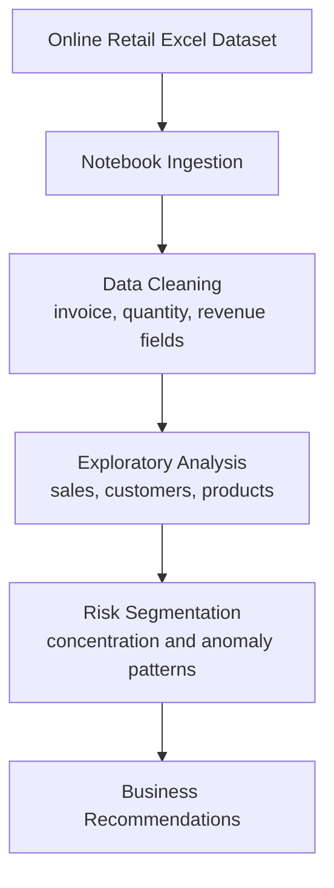

# Business Portfolio Risk Analysis

**GitHub Repository:** [praveenraj9623-sketch/Business-Portfolio-Risk-Analysis](https://github.com/praveenraj9623-sketch/Business-Portfolio-Risk-Analysis)

> A notebook-based business analytics project that uses retail transaction data to analyze portfolio performance, customer behavior, sales concentration, and commercial risk patterns.

[](https://jupyter.org)
[](https://python.org)
[](https://pandas.pydata.org)
[](https://www.microsoft.com/microsoft-365/excel)

[](https://praveenraj9623-sketch.github.io/)
[](https://github.com/praveenraj9623-sketch/Business-Portfolio-Risk-Analysis)

---

## What is This Project?

This repository contains a business portfolio risk analysis workflow built around the `Online Retail.xlsx` dataset. The notebook analyzes sales patterns, customer contribution, product behavior, and transaction-level signals that can help business teams understand concentration risk and revenue quality.

**Core outcome:** transaction data -> exploratory analysis -> risk indicators -> business insights -> portfolio recommendations.

---

## Business Questions

| Question | Analysis direction |
|---|---|
| Which customers or products dominate revenue? | Contribution and concentration analysis |
| Are there unusual transaction patterns? | Outlier and quantity/value checks |
| Where does portfolio risk appear? | Customer, product, and country-level segmentation |
| What should stakeholders monitor? | Actionable business metrics and recommendations |

---

## Workflow Architecture



---

## Tech Stack

| Category | Tools |
|---|---|
| Analysis Environment | Jupyter Notebook |
| Data Source | Excel workbook |
| Data Processing | Python, Pandas, NumPy |
| Visualization | Matplotlib / Seaborn-style notebook charts |
| Business Analytics | EDA, segmentation, concentration analysis |

---

## Repository Contents

```text
Business-Portfolio-Risk-Analysis/
|-- Business Portfolio Risk Analysis (1).ipynb
|-- Online Retail.xlsx
`-- README.md
```

---

## How to Run

```bash
git clone https://github.com/praveenraj9623-sketch/Business-Portfolio-Risk-Analysis.git
cd Business-Portfolio-Risk-Analysis
python -m venv .venv
.venv\Scripts\activate
pip install pandas numpy matplotlib seaborn openpyxl jupyter
jupyter notebook
```

Open:

```text
Business Portfolio Risk Analysis (1).ipynb
```

---

## Suggested Notebook Flow

1. Load the Excel dataset.
2. Validate invoice, customer, product, country, quantity, and price fields.
3. Create revenue and transaction-level metrics.
4. Analyze customer and product concentration.
5. Identify unusual order values or negative quantities.
6. Summarize business risks and opportunities.

---

## Limitations

- This is a notebook analytics project, not a deployed application.
- The dataset is historical and should be refreshed before operational use.
- Business conclusions depend on data completeness and cleaning decisions.

---

## Future Improvements

- Convert the notebook into a Streamlit dashboard.
- Add RFM segmentation and cohort analysis.
- Add anomaly detection for transaction monitoring.
- Export an executive summary report automatically.

---

## Author

Built by **Praveen Raj A**

- GitHub: https://github.com/praveenraj9623-sketch
- LinkedIn: https://www.linkedin.com/in/praveen-raj-a-b05abb2a3/
- Repository: https://github.com/praveenraj9623-sketch/Business-Portfolio-Risk-Analysis
